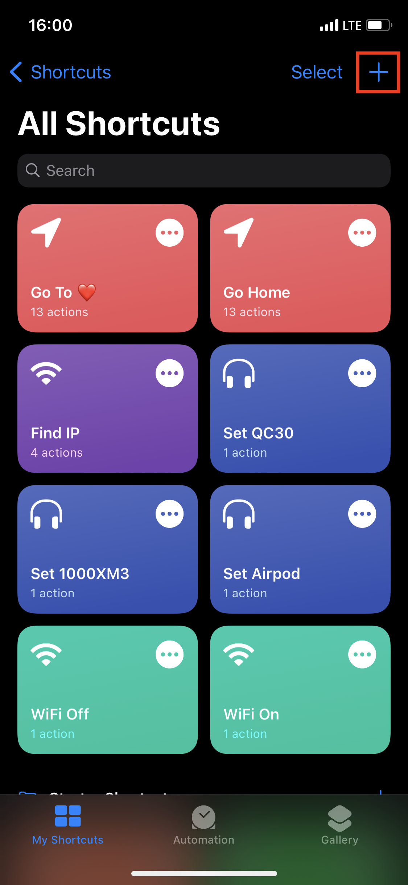
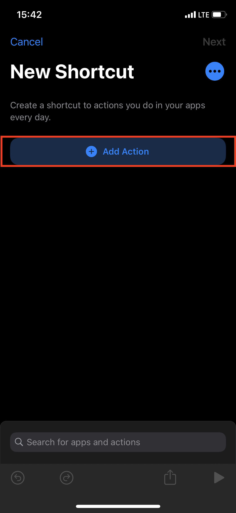
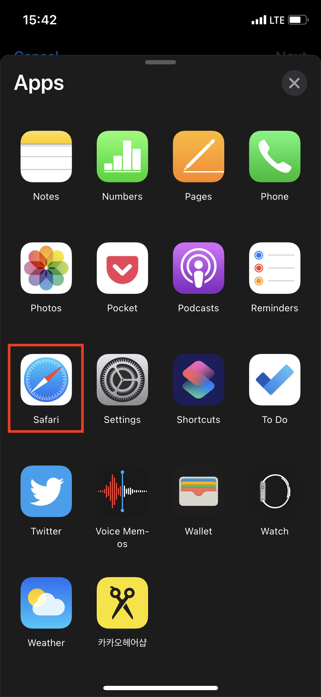
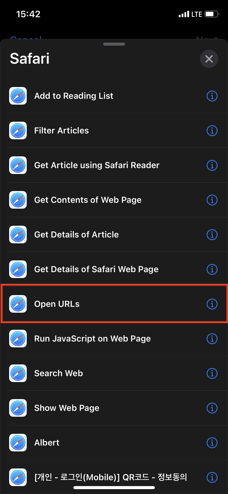
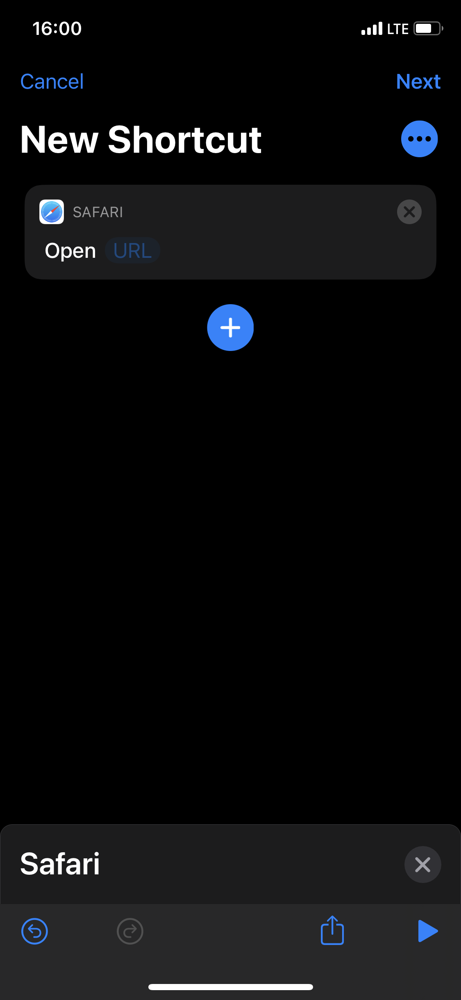
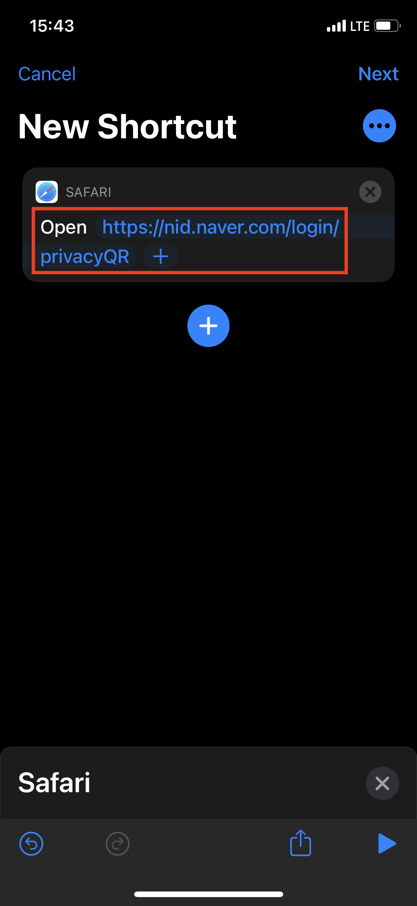
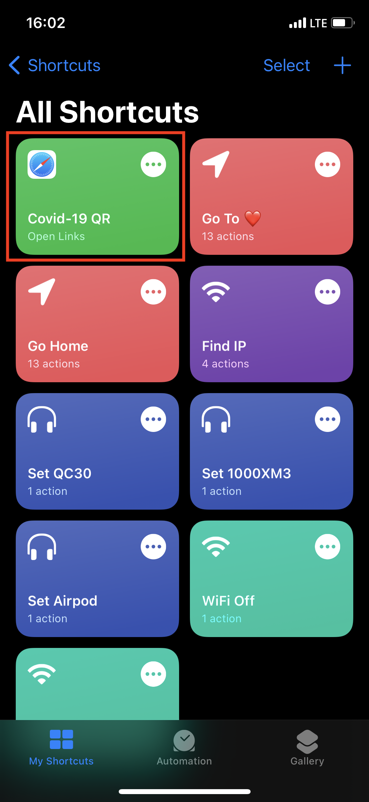

# iOS14 의 Back Tap 기능을 이용한 Covid-19 QR체크인 간소화

## Shortcuts 준비

1. `Shortcuts` 앱을 실행합니다.

2. `+` 버튼을 눌러 새 Shortcuts 등록을 시작합니다.

3. `+ Add Action` 버튼을 누릅니다.

4. `Apps` 를 선택합니다.

5. `Safari` 를 선택합니다.

6. `Open URLs` 를 선택합니다.

7. `URL` 부분에 주소를 입력합니다.
  - 내가 만약 네이버 체크인을 사용한다면:
    - `https://nid.naver.com/login/privacyQR`
  - 내가 만약 카카오 체크인을 사용한다면:
    - `kakaotalk://con/web?url=https://accounts.kakao.com/qr_check_in`
 

8. `Covid-19 QR` Shortcut 이 등록된 것을 확인하고 종료합니다.

## Back tap 등록

1. `Settings` 앱을 실행합니다.

2. `Accessibility` 를 선택합니다.

3. `Touch` 를 선택합니다.

4. `Back Tap` 을 선택합니다.

5. 선호에 따라 `Double Tap` 혹은 `Triple Tap` 을 선택합니다.

6. 목록의 하단에서 위에서 생성한 `Covid-19 QR` 을 찾아 선택합니다.

7. 선택한 메뉴에 `Covid-19 QR` 이 설정되었는지 확인합니다.

## 사용

아무곳에서나 단말기의 뒷부분을 천천히 더블탭 혹은 트리플탭 하면 실행됩니다.
